# Lab15

## Components description: 

* The prometheus operator manages the deployment and configuration of Prometheus. It automates the creation and updating of kube-prometheus-stack instances through Custom Resource Definitions.

* HA Prometheus is a tool for monitoring applications and used resources inside the Kubernetes cluster.

* HA Alertmanager is a part of Prometheus that handles and provides alerts for the developer.

* Prometheus node-exporter is an agent that export machine metrics for the Prometheus.

* Prometheus blackbox-exporter is an exporter for probing network endpoints (HTTP, HTTPS, DNS, etc.)

* Prometheus Adapter for Kubernetes Metrics APIs provides Prometheus metrics to the Kubernetes API. Applicable for autoscaling the cluster.

* kube-state-metrics is a service that colletcs data from Kubernetes objects and exports collected metrics to Prometheus.

* Grafana is a web interface for metrics visualization. It is highly customizable and allows an integration with Prometheus.

## Kubernetes resources:

* Pods for alertmanager, prometheus and grafana, 3 replicas of custom app

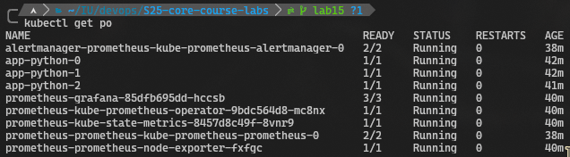

* Statefulsets in the cluster (3 replicas of custom app, alertmanager, prometheus)

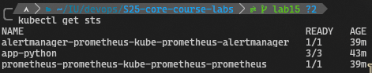

* Accessible services of custom app, grafana and prometheus and ports opened for these services

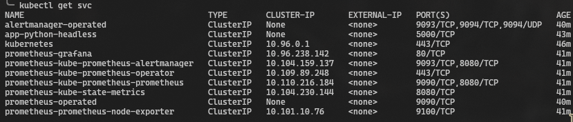

* PersistentVolumeClaim for requesting a persistent volume for cluster

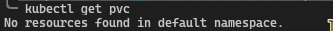

* ConfigMap for prometheus and grafana

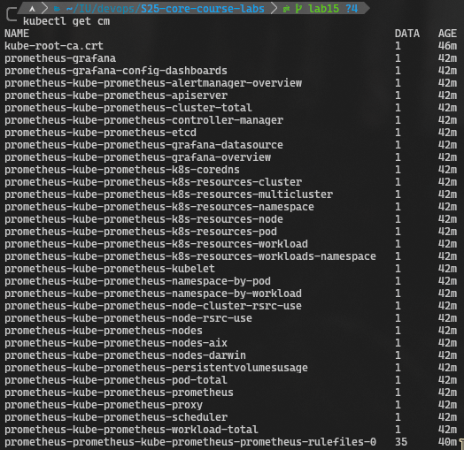

## Grafana Dashboards:

* a. 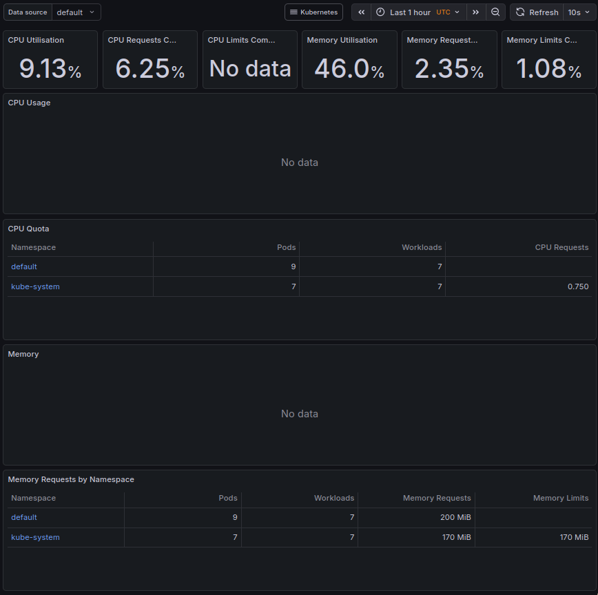

* b. 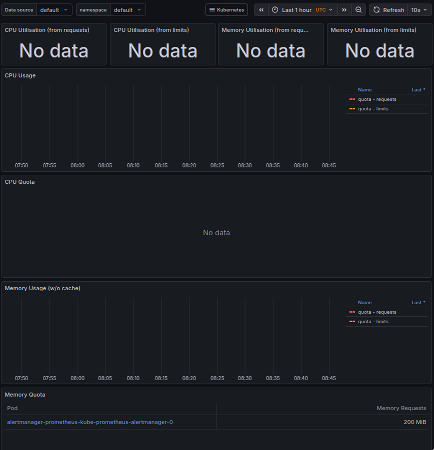

* c. 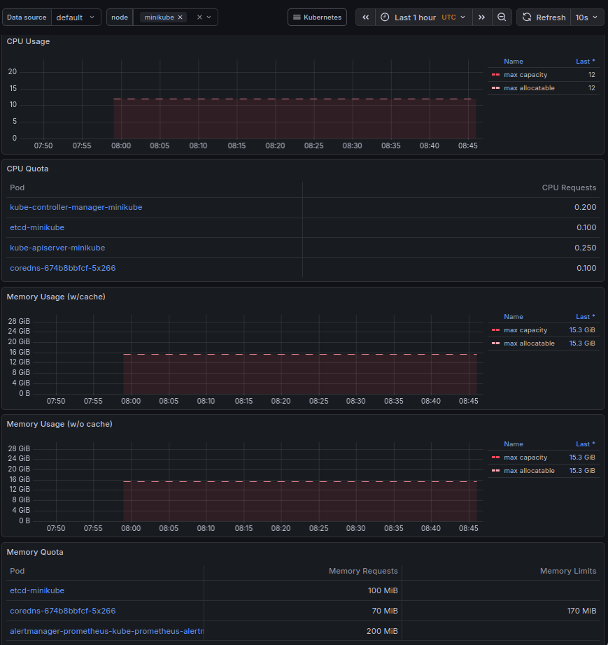

* d. 16 pods and 24 containers:

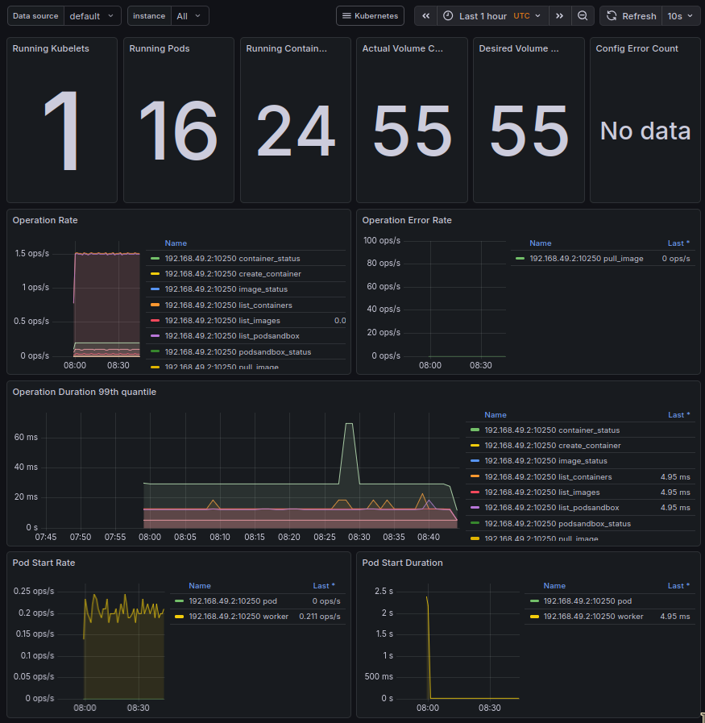

* e. 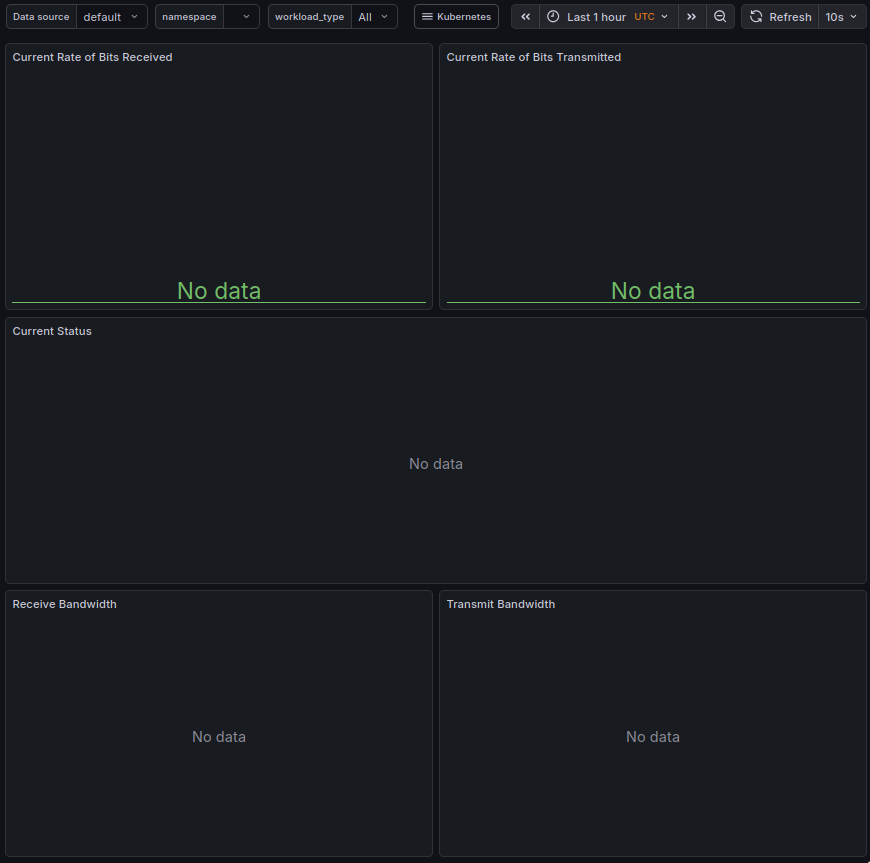

* f. 6 alerts in total:

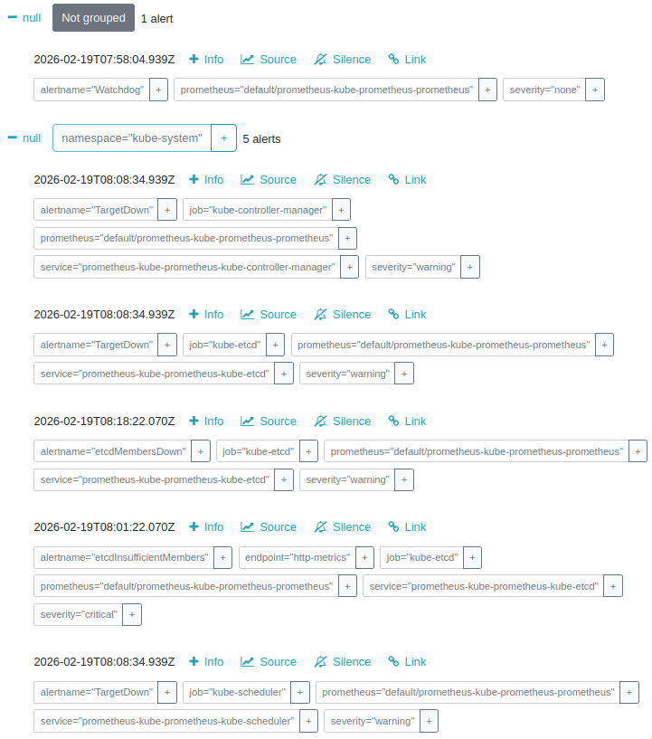